# Nexus Control

Nexus Control 是一个运行在 Windows 本机上的终端与本地服务编排工具。它用 Electron 承载桌面窗口，用 React 构建管理界面，用 xterm.js 显示真实终端，并通过项目内的 Node.js 后端连接 WSL Ubuntu、Windows PowerShell、PowerShell 7 和 CMD。

它适合管理服务器、测试服务、脚本任务和其他需要多个终端协作的本地项目。终端、服务、命令、编排、定时任务和日志都保存在本机，不需要云端账号；后端默认只监听 `127.0.0.1`。

> 截图中的服务名、路径和数量来自离线演示数据，仅用于说明界面。实际内容以你的终端配置和运行环境为准。

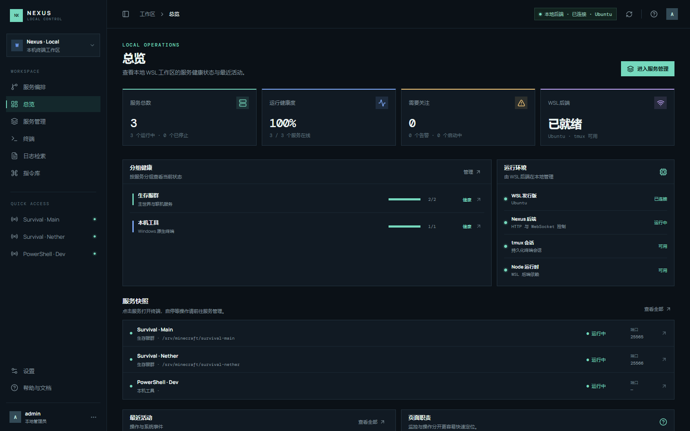

## 主要能力

| 能力 | 说明 |
| --- | --- |
| 多类型终端 | 新建 WSL Ubuntu、Windows PowerShell、PowerShell 7 或 CMD 终端 |
| 真实交互终端 | xterm.js + PTY，支持 Tab 补全、方向键历史、Ctrl+C、ANSI 颜色和窗口 resize |
| 持久会话 | WSL 服务可绑定 `nexus-<serverId>` tmux 会话，断线或重启应用后重新接入 |
| 分组管理 | 创建服务分组，按分组或单个服务勾选、停止、删除和刷新 |
| 指令库 | 保存常用命令，支持直接执行、仅粘贴、编辑、删除、导入和导出 |
| 批量执行 | 在指令库中勾选多个服务，并行广播同一条命令并返回逐端结果 |
| 服务编排 | 顺序步骤、并行分支、服务动作、等待、日志关键字、超时、重试和失败策略 |
| 定时任务 | 按指定日期时间执行，或按固定间隔执行一次/循环执行；可执行编排或命令 |
| 日志检索 | 每个终端独立保存最近一次启动日志，支持跨终端搜索和完整上下文查看 |
| Agent 接入 | 内置本地 MCP Server，可让 Agent 读取终端和日志；执行命令需要显式确认 |

## 页面导航

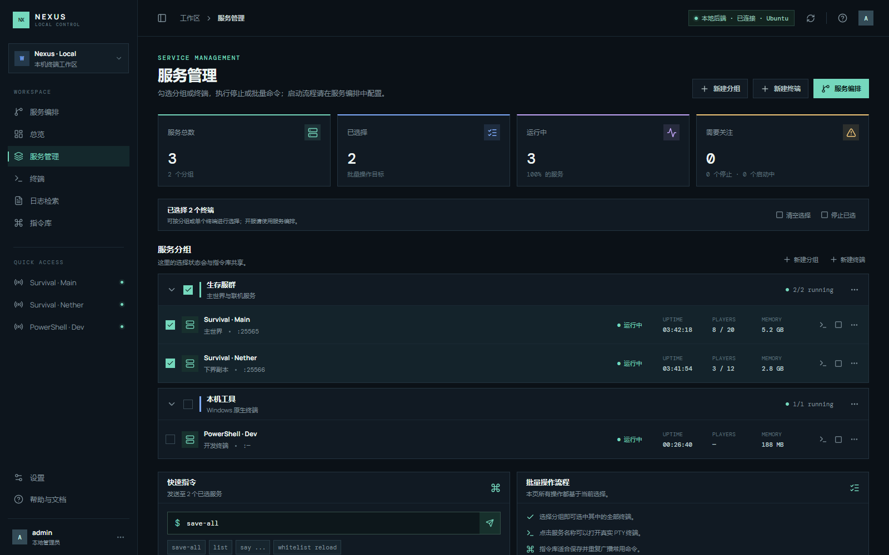

- **服务编排**：配置一键开服流程、顺序/并行步骤和定时任务。
- **总览**：查看服务数量、运行状态、WSL 和 tmux 健康度。
- **服务管理**：管理分组、终端、勾选目标、停止和删除。
- **终端**：连接真实 PTY，在终端中输入命令；左侧可打开当前终端的指令库。
- **日志检索**：按终端过滤、搜索历史输出、查看上下文或打开日志文件。
- **指令库**：维护命令、批量选择服务、执行/粘贴命令，以及导入导出命令库。
- **设置**：切换中文/English、深色/浅色主题、查看依赖和安装 tmux。
- **帮助与文档**：打开完整的中文操作手册：[docs/帮助与文档.md](docs/帮助与文档.md)。

## 快速开始

### 环境要求

- Windows 10/11。
- Node.js 和 npm（开发版需要）。
- WSL Ubuntu（使用 WSL 终端或持久服务会话时需要）。
- tmux 是可选依赖。没有 tmux 时普通 WSL 终端仍可用，但服务无法在应用重启后保持会话。

应用不会自动修改 Windows Terminal、注册表、Windows 服务或 WSL 配置，也不会静默安装系统依赖。设置页中的 tmux 安装只有在用户确认后才会执行。

### 安装依赖

在 **PowerShell** 中进入项目目录后执行：

```powershell
cd E:\airtest\terminal_maneger
npm.cmd install
```

如果看到 `C:\Windows\system32\package.json: ENOENT`，说明 npm 是在错误的目录执行的；先执行上面的 `cd`。

### 启动 Electron（推荐）

```powershell
cd E:\airtest\terminal_maneger
npm.cmd run dev
```

该命令会启动 Vite、Electron，以及由 Electron 管理的本地 WSL 后端。应用窗口打开后，右上角应显示“本地后端 · 已连接”。窗口最小化时后端和调度器继续运行；正常退出应用时调度器停止，已有 tmux 服务会话保留。

### 仅预览网页

```powershell
npm.cmd run web
```

浏览器预览适合查看 UI。后端不可用时会显示离线预览终端，不会替代 Electron 的窗口生命周期管理和真实 PTY。需要手动同时运行网页与后端时使用：

```powershell
npm.cmd run dev:full
```

### 构建和启动已构建版本

```powershell
npm.cmd run build
npm.cmd start
```

构建检查也可以单独执行：

```powershell
npm.cmd run build
```

## 创建终端

在“终端”页面点击右上角 **New terminal** 或终端列表旁的加号。

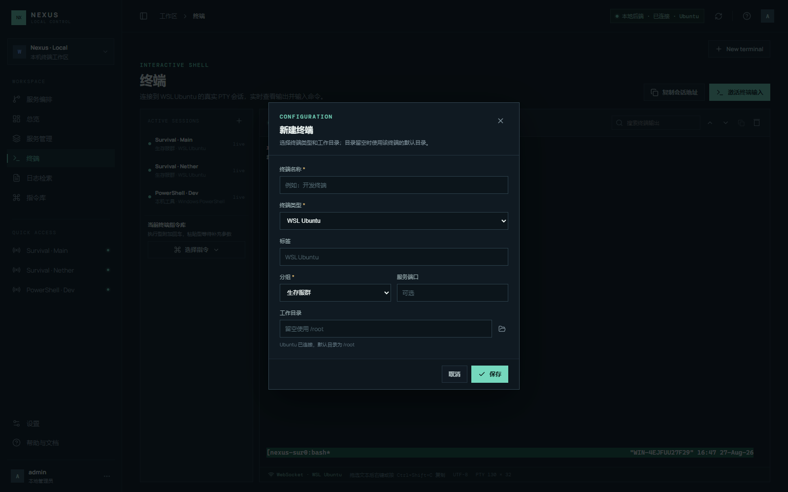

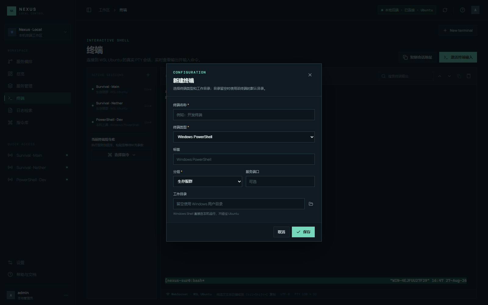

支持的终端类型：

- **WSL Ubuntu**：通过 `wsl.exe` 启动 bash；目录留空时使用 `/root`。
- **Windows PowerShell**：直接运行本机 `powershell.exe`。
- **PowerShell 7**：本机安装 `pwsh.exe` 后可用。
- **命令提示符（CMD）**：直接运行本机 `cmd.exe`。

Windows Shell 目录留空时使用当前 Windows 用户目录。WSL 目录使用 Linux 路径，例如 `/srv/minecraft/main`。名称、类型、目录和分组保存后会写入正式配置并刷新终端列表。

正式配置路径固定为：

```text
E:\airtest\terminal_maneger\backend\servers.json
```

应用首次使用时可以从界面新建终端，不要求预先填写服务。没有 `servers.json` 时，后端会只读加载 `servers.example.json` 作为演示配置。

## 服务管理与删除


1. 点击分组复选框可全选或取消该分组的终端。
2. 点击单个终端复选框可单独选择。
3. 分组选择会同步到指令库，用于批量执行命令。
4. 更多操作中可以打开终端、停止服务或删除终端。

删除终端时，应用会先停止对应 PTY/tmux 会话，并尝试释放该终端配置的端口，确认清理完成后才从配置中移除；之后会刷新服务管理和终端列表。若端口被应用外部的进程占用，应用会提示占用情况，避免误删其他程序。

服务管理页不提供写死的“启动已选”命令。不同服务的目录、启动脚本和就绪条件可能不同，开服统一在“服务编排”中配置。

## 真实终端

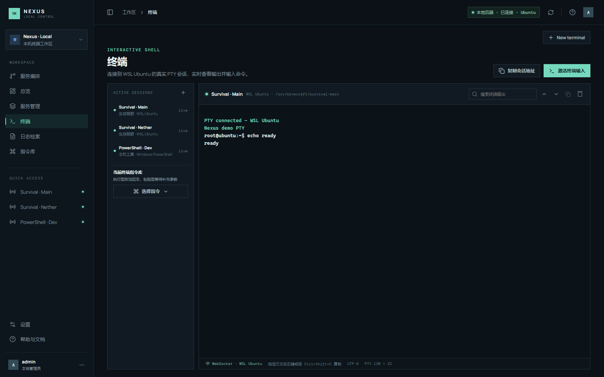

Electron 后端连接成功后，右侧是 xterm.js PTY 画布，不是静态文本。真实终端支持：

- bash、PowerShell、PowerShell 7 和 CMD 的原生输入。
- Tab 自动补全和上下方向键历史。
- Ctrl+C 中断命令。
- ANSI 颜色、光标和窗口尺寸同步。
- 断线自动重连；新连接会接管旧连接，避免切换终端时闪烁。
- 终端滚动、鼠标选择复制和 Ctrl+Shift+C 复制。
- 工具栏搜索当前终端画布内容。

终端左侧的指令工具栏只作用于当前终端。选择命令后：

- **直接执行**：发送命令并自动回车。
- **粘贴到终端**：只写入输入区，不回车，适合需要手动补参数的命令。

## 指令库

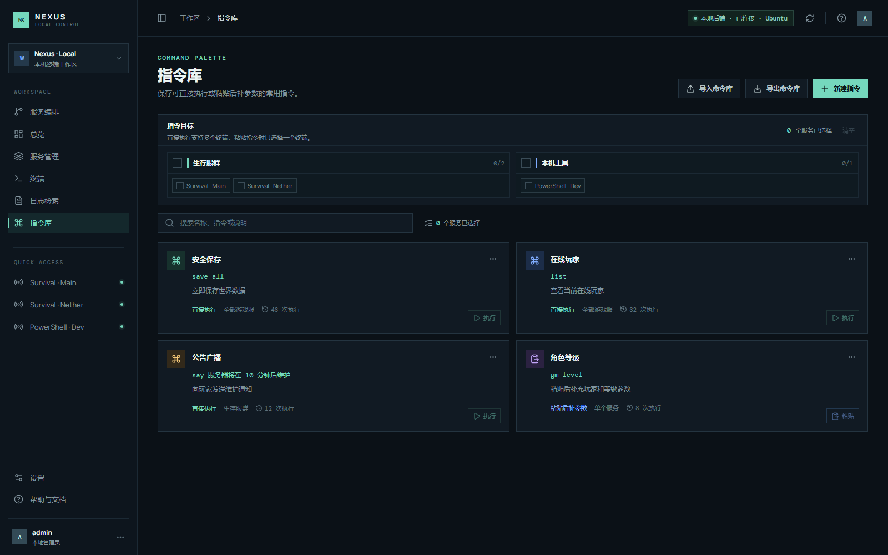

### 选择服务并批量执行

在“指令目标”区域可以勾选整个分组、部分终端或单个终端，然后执行指令。直接执行型命令会并行发送到多个终端，并返回每个终端的成功/失败信息。粘贴型命令需要只选择一个终端，方便用户继续补参数。

### 新建、编辑和删除

点击“新建指令”填写名称、命令内容、发送方式、说明、适用范围和颜色。

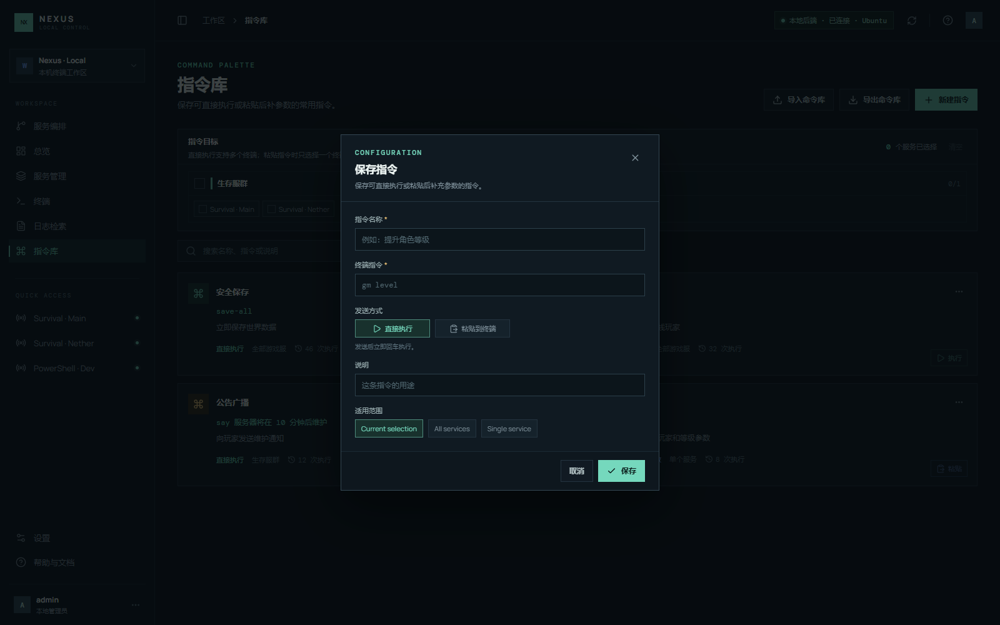

卡片右上角的三个点菜单可以编辑、复制、切换发送方式或删除：

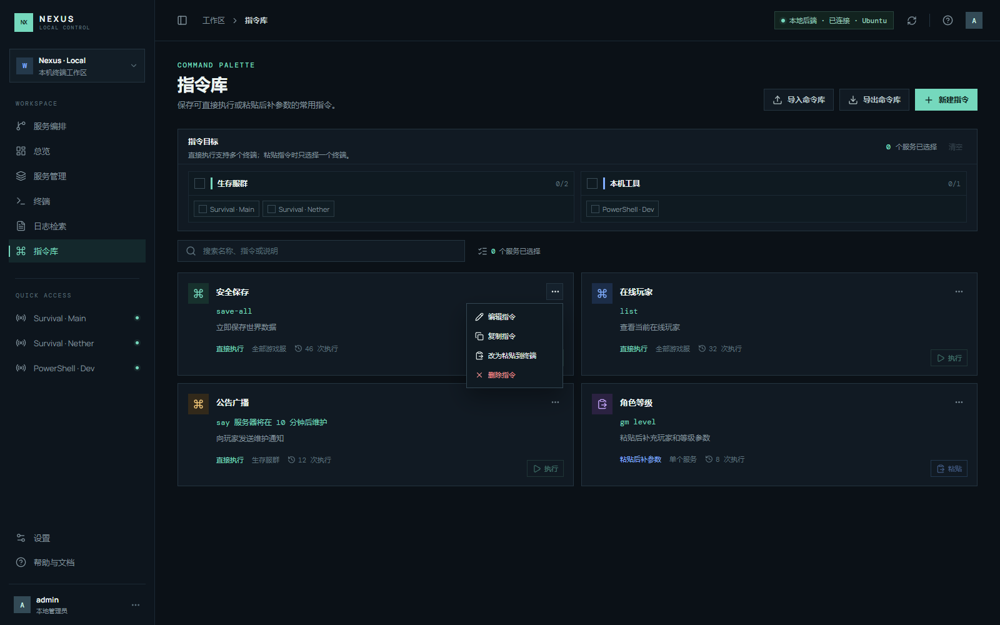

保存或删除后页面会立即刷新，并同步写入 `servers.json`。

### 导入和导出

“导出命令库”生成版本化 JSON 文件，包含名称、命令、说明、发送方式、适用范围和颜色，不包含本机终端、路径、端口或日志。导入采用合并模式，完全重复的指令自动跳过，新导入指令的执行次数从零开始。

## 服务编排

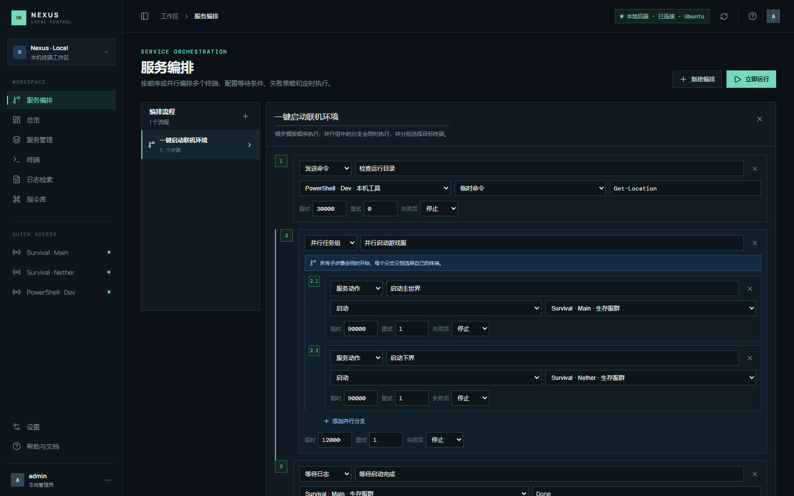

服务编排是“一键开服”的配置入口。根步骤按顺序执行，并行组中的分支同时开始。

支持的步骤：

- **发送命令**：选择目标终端，再选择指令库命令或输入临时命令。
- **服务动作**：对指定终端执行启动、停止或重启；启动命令来自该终端配置。
- **固定等待**：等待指定毫秒数。
- **等待日志**：等待指定终端的日志出现关键字。
- **并行任务组**：每个分支选择一个目标终端，由后端分别下发任务。

并行的含义是“不同分支交给不同终端同时执行”，不是让同一终端并行执行多条命令。同一并行组不能有两个分支指向同一个终端。每个步骤可配置超时、重试次数，以及失败后停止或继续。

建议的开服流程：新建编排 → 添加服务动作并指定终端 → 按依赖关系安排顺序或并行分支 → 添加固定等待/日志关键字等待 → 设置超时和重试 → 保存并运行。

## 定时任务

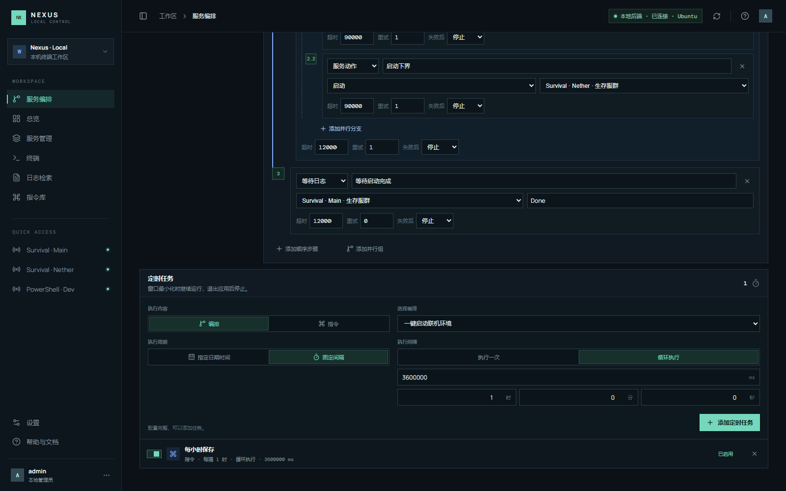

定时任务可以选择：

- 执行已保存的服务编排。
- 执行指令库命令或临时命令，并指定目标终端。

周期支持：

- **指定日期时间**：到达本机日期和时间后执行一次。
- **固定间隔**：可选择执行一次或循环执行；毫秒与时/分/秒输入会相互换算。

调度器运行在 WSL 后端中，窗口最小化后仍然工作；退出 Electron 后停止调度，不使用系统 Cron 或 Windows 任务计划。

## 日志检索

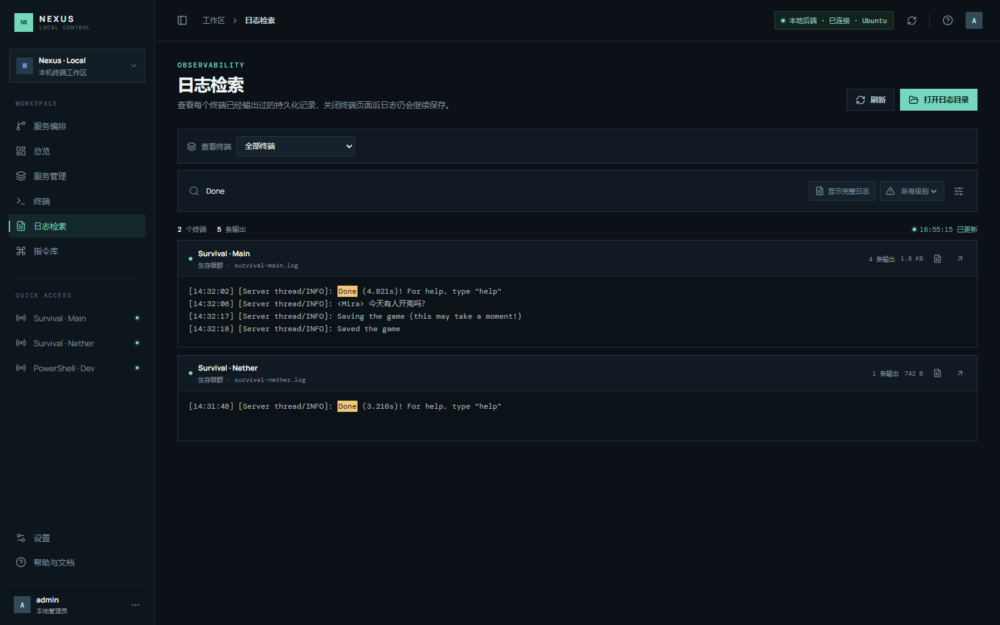

每个终端对应一个日志文件，源码运行时位于：

```text
目录名\terminal_maneger\backend\logs
```

执行服务启动动作时会清空该服务上一次启动产生的日志，之后 PTY/tmux 输出实时追加。日志页支持：

- 按终端筛选。
- 搜索命令、报错、玩家名称或任意输出文本。
- 按 Info、Warning、Error 级别筛选。
- 在“仅显示结果”和“显示完整日志”之间切换。
- 完整日志模式下保留上下文并高亮匹配内容。
- 打开对应终端的完整日志文件或跳转到终端页面。

## 设置与主题

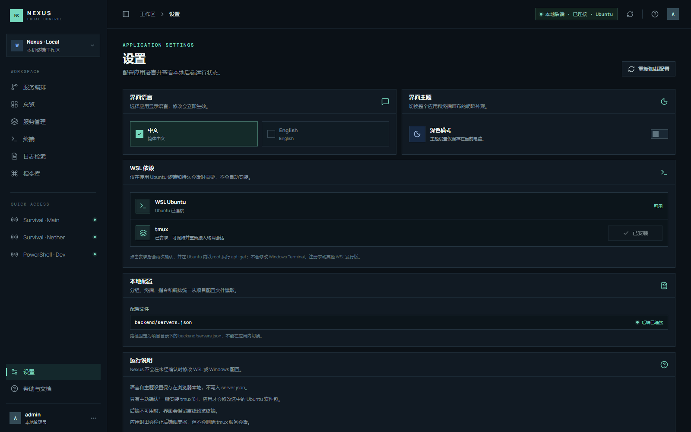

设置页提供：

- 中文 / English 切换。
- 深色 / 浅色主题切换。深色主题使用绿色强调色，浅色主题使用 `#339CFF`。
- WSL、Node、tmux 和配置状态检查。
- 用户确认后安装 tmux。
- 查看固定的 `backend/servers.json` 配置路径和运行说明。

## Agent / MCP 接入

项目内置使用标准输入输出通信的本地 MCP Server，不监听额外网络端口。先启动 Nexus Electron，再在支持 MCP 的 Agent 中添加：

```powershell
cd 用户目录\terminal_maneger
codex.cmd mcp add nexus-local -- node 用户目录/terminal_maneger/mcp/server.cjs
```

手动配置示例：

```toml
[mcp_servers.nexus-local]
command = "node"
args = ["目录名/terminal_maneger/mcp/server.cjs"]
```

可用工具：

- `list_terminals`：列出终端、分组和日志路径。
- `read_terminal_log`：读取指定终端最近输出。
- `search_terminal_log`：跨终端搜索日志并返回上下文。
- `watch_terminal_log`：按 cursor 等待增量输出。
- `send_terminal_command`：发送命令，默认只返回预览。

MCP 默认只读。允许 Agent 执行命令时，需要在配置中显式加入：

```toml
[mcp_servers.nexus-local.env]
NEXUS_MCP_ALLOW_COMMANDS = "1"
```

并且每次调用 `send_terminal_command` 都必须传入 `confirm: true`。当前源码版 MCP 可直接通过 `node mcp/server.cjs` 使用；正式安装版/便携版尚未实现 `Nexus Control.exe --mcp` 的独立入口。

## 数据与接口

正式配置文件：`backend/servers.json`。配置包含分组、终端、命令、编排、定时任务和设置。保存使用临时文件替换，降低中断造成半截 JSON 的风险。日志目录为 `backend/logs`；打包版使用应用目录下的 `data\logs`。

后端只监听 `127.0.0.1:4317`，主要接口包括：

| 方法 | 路径 | 用途 |
| --- | --- | --- |
| GET | `/health` | 查看 WSL、Node、tmux 和终端状态 |
| GET / PUT | `/api/config` | 读取或保存完整配置 |
| POST | `/api/servers/:id/action` | 执行服务动作 |
| DELETE | `/api/servers/:id` | 停止、清理并删除终端 |
| POST | `/api/commands/dispatch` | 并行广播命令 |
| POST | `/api/workflows/:id/run` | 运行服务编排 |
| GET | `/api/runs/:runId` | 查询编排运行状态 |
| GET | `/api/logs` | 查询终端日志 |
| WebSocket | `/terminal/:serverId` | 传输 PTY 输入、输出和状态 |

## 常见问题

### 后端显示离线

确认使用 `npm.cmd run dev` 启动 Electron，并检查：

```powershell
Invoke-WebRequest http://127.0.0.1:4317/health
wsl.exe -l -v
```

后端不可用时页面会保留离线预览终端；恢复后会自动尝试重连真实 PTY。

### WSL 或 tmux 不可用

WSL 终端需要发行版可用，例如：

```powershell
wsl.exe -l -v
wsl.exe -d Ubuntu-18.04 -- uname -a
```

tmux 可在设置页确认后安装，也可以在 Ubuntu 中手动安装。没有 tmux 时仍可使用普通 WSL 终端。

### 修改 `servers.json` 后页面没有变化

保存外部修改后点击顶部刷新按钮，或重新加载页面。页面存在未保存编辑时，先完成或放弃编辑再刷新。

### 删除后端口仍被占用

应用只负责清理该终端的 PTY/tmux 和配置中声明的端口。若端口由外部进程占用，需要先停止外部进程，再重试删除。

### 启动命令应该写在哪里

把每个服务实际使用的命令写在对应终端的 `startCommand`，再在编排中使用“服务动作”步骤调用。

## 安全与维护

- 保持后端监听地址为 `127.0.0.1`，不要在没有认证的情况下改成 `0.0.0.0`。
- 定期备份 `backend/servers.json` 和 `backend/logs`。
- 导入或分享命令库前，检查命令是否包含密码、令牌或内部路径。
- 启用 Agent 命令执行前确认 `NEXUS_MCP_ALLOW_COMMANDS`，并保留 `confirm: true`。
- 不要把日志目录提交到公共仓库，日志可能包含账号、路径、玩家名和服务输出。

更完整的逐页操作说明见 [docs/帮助与文档.md](docs/帮助与文档.md)。
